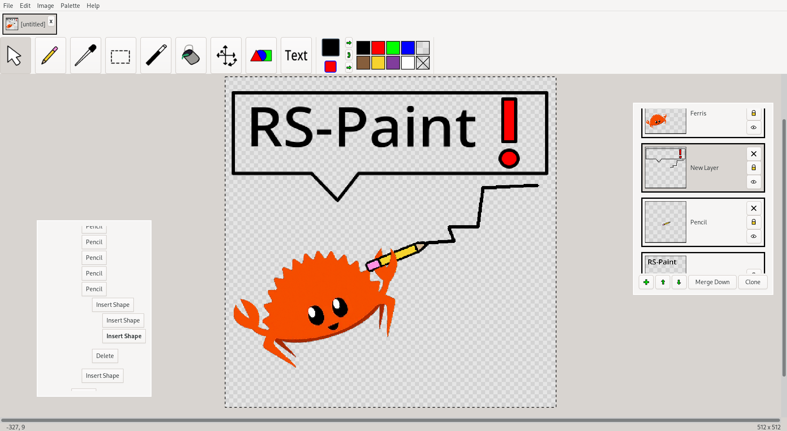

# RS-Paint



A lightweight image editor, written in Rust using GTK4.

## Setup

```sh
# 1. Install gtk4
sudo pacman -S gtk4 base-devel # Arch &c
sudo apt install libgtk-4-dev build-essential # Debian &c
sudo dnf install gtk4-devel gcc # Fedora &c

# 2. build and run
cargo run
```

## Goals

- Match the intuition and simplicity of MS-Paint
- Add core features and ergonomics MS-Paint lacks
- Be cross-platform, free, and open-source

## Features

- Basic Tools
    - Cursor (pan)
    - Pencil (+ various brushes and blending modes)
    - Eyedropper
    - Rectangle Select
    - Magic Wand
    - Fill
    - Free Transform (Translate, Scale, Rotate)
    - Shapes
    - Text
- Color Palette
    - Primary and Secondary Colors
    - Import/Export Palette
- Image Transformations
  - Flips
  - Rotations
  - Resizes
      - Cropping
      - Expansion
      - Scaling
- I/O
    - Import/Export (most common formats are supported)
    - Save/Load (project files)
- Complexity Management
    - Tabs
    - Layers
        - Merging, Cloning and Rearranging
        - Visibility Toggle
        - Modification Locking
    - Multi-Level Undo
        - Tree-View, Click-to-Navigate
- Misc.
    - Copy/Paste (internal selections and external clipboard)
    - Keybinds (see Help/Keyboard-Shortcuts)
